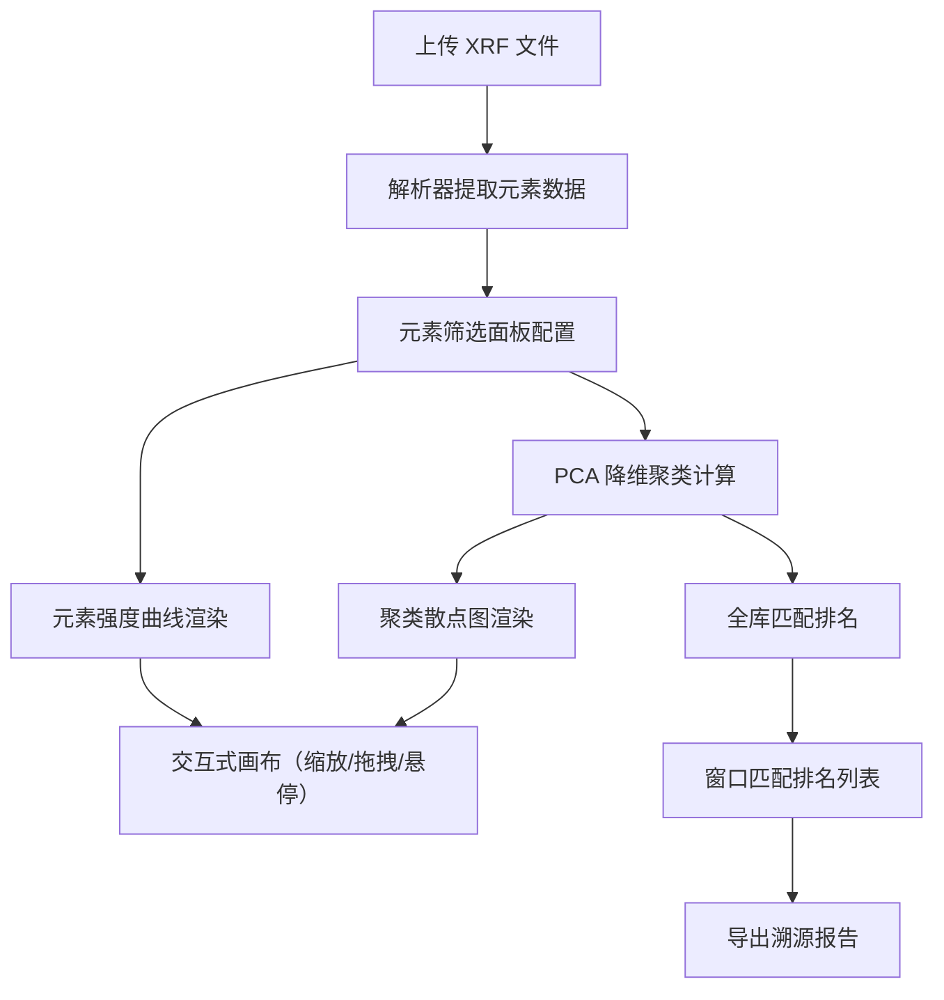

## 1. 产品概述

考古理化实验室线上溯源系统——面向考古研究人员，通过上传古陶 XRF 元素检测谱，借助 PCA 降维聚类分析区分窑口产地，实现从元素数据到产地溯源的全链路在线化。目标用户为考古实验室科研人员与博物馆文物鉴定专家。

## 2. 核心功能

### 2.1 用户角色

| 角色 | 使用方式 | 核心权限 |
|------|----------|----------|
| 考古研究人员 | 浏览器直接访问 | 上传数据、聚类分析、导出报告 |
| 文物鉴定专家 | 浏览器直接访问 | 全库匹配溯源、筛选比对 |

### 2.2 功能模块

1. **溯源分析主页**：文件上传、元素筛选、双画布可视化、窑口匹配排名、报告导出

### 2.3 页面详情

| 页面名称 | 模块名称 | 功能描述 |
|----------|----------|----------|
| 溯源分析主页 | 文件上传区 | 支持 XRF 设备导出的 CSV/TSV/TXT 多格式文本，自动识别分隔符，提取元素种类与对应强度数值 |
| 溯源分析主页 | 元素筛选面板 | 自定义元素筛选范围（勾选/区间），设置聚类置信阈值，触发批量全库匹配 |
| 溯源分析主页 | 元素强度曲线画布 | 上方画布，多组 XRF 元素谱叠加对比，支持缩放拖拽，鼠标悬停显示元素名称与强度 |
| 溯源分析主页 | PCA 聚类散点画布 | 下方画布，二维散点图区分不同古窑样本，不同窑口用不同颜色标记，鼠标悬停显示样本详情 |
| 溯源分析主页 | 窑口匹配排名列表 | 底部列表，按相似度排名展示全库匹配结果，显示窑口名称、相似度分数、样本数 |
| 溯源分析主页 | 报告导出 | 一键生成溯源报告（含元素数据、聚类图、匹配排名），导出为 HTML/PNG |

## 3. 核心流程

用户上传 XRF 检测数据文件 → 系统解析提取元素种类与强度值 → 用户在筛选面板选择目标元素与阈值 → 元素强度曲线画布实时渲染多组叠加谱线 → PCA 降维计算生成二维聚类散点 → 全库批量匹配输出窗口排名列表 → 用户导出溯源报告

## 4. 用户界面设计

### 4.1 设计风格

- **主色调**：低饱和复古色系——陶土赭(#8B7355)、青铜绿(#5B7553)、古纸米(#F5F0E8)、墨玉黑(#2C2C2C)
- **辅助色**：窑火橙(#C4753B)、釉青(#6B8E8E)、朱砂红(#A0522D)
- **按钮风格**：圆角微浮雕，hover 时边框提亮，配合细微阴影
- **字体**：标题使用 Noto Serif SC（宋体风格），正文使用 Noto Sans SC
- **布局**：左侧固定栏 + 中央双画布堆叠 + 底部排名列表，三栏古典比例
- **背景纹理**：宣纸纹理噪点叠加，边框采用回纹装饰线

### 4.2 页面设计概述

| 页面名称 | 模块名称 | UI 元素 |
|----------|----------|---------|
| 溯源分析主页 | 文件上传区 | 拖拽上传框、文件格式提示、已上传文件标签 |
| 溯源分析主页 | 元素筛选面板 | 元素复选框组、强度范围滑块、置信阈值输入、全选/反选按钮 |
| 溯源分析主页 | 元素强度曲线画布 | D3 SVG 画布、多色谱线叠加、坐标轴标注、缩放拖拽控件、图例 |
| 溯源分析主页 | PCA 聚类散点画布 | D3 SVG 画布、散点着色、椭圆置信区域、悬停 Tooltip、图例 |
| 溯源分析主页 | 窑口匹配排名列表 | 表格排名行、相似度进度条、窑口标签色块、样本数徽章 |
| 溯源分析主页 | 报告导出 | 导出按钮组（HTML/PNG）、导出状态提示 |

### 4.3 响应式设计

桌面优先设计，最低分辨率 1280×720；中央画布区支持弹性伸缩；左侧栏在窄屏可折叠为抽屉

### 4.4 性能约束

- 馆藏 1600 条陶土样本全量 PCA 聚类计算 ≤ 350ms
- 画布缩放拖拽帧率 ≥ 30fps（D3 zoom + requestAnimationFrame 节流）
- LocalStorage 缓存检索历史与筛选参数，页面刷新不丢失
