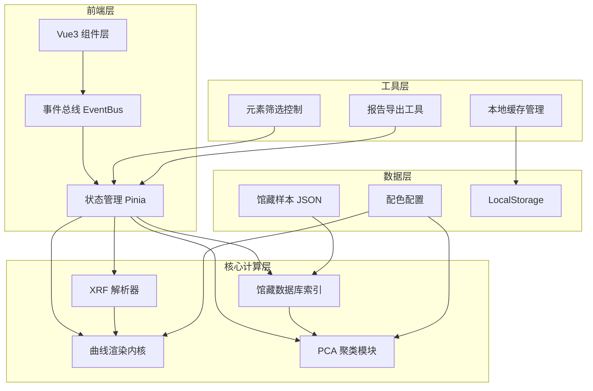

## 1. 架构设计



## 2. 技术说明

- **前端框架**：Vue 3 + TypeScript + Composition API
- **构建工具**：Vite
- **可视化库**：D3.js v7（SVG 渲染 + zoom + axis + line + scatter）
- **样式方案**：Tailwind CSS + CSS Variables（文物配色主题）
- **状态管理**：Pinia
- **初始化工具**：vite-init (vue-ts template)
- **后端**：无（纯前端，数据本地化）
- **数据库**：LocalStorage + 馆藏样本 JSON 静态数据

## 3. 路由定义

| 路由 | 用途 |
|------|------|
| `/` | 溯源分析主页（唯一页面，单页应用） |

## 4. 模块架构

### 4.1 文件结构

```
src/
├── assets/
│   └── textures/           # 宣纸纹理等
├── components/
│   ├── FileUpload.vue      # 文件上传区
│   ├── FilterPanel.vue     # 元素筛选面板
│   ├── CurveCanvas.vue     # 元素强度曲线画布
│   ├── ScatterCanvas.vue   # PCA 聚类散点画布
│   ├── MatchRanking.vue    # 窑口匹配排名列表
│   └── ReportExport.vue    # 报告导出
├── composables/
│   ├── useEventBus.ts      # 组件事件总线
│   ├── useLocalStorage.ts  # 本地缓存管理
│   └── useZoom.ts          # 画布缩放拖拽
├── core/
│   ├── xrfParser.ts        # XRF 原始数据解析器
│   ├── curveRenderer.ts    # 元素强度曲线渲染内核
│   ├── pcaEngine.ts        # PCA 降维聚类计算模块
│   └── dbIndex.ts          # 馆藏陶土数据库本地索引
├── data/
│   ├── samples.json        # 馆藏样本数据（1600条）
│   └── palette.ts          # 文物低饱和配色配置
├── stores/
│   └── analysisStore.ts    # Pinia 分析状态
├── types/
│   └── index.ts            # TypeScript 类型定义
├── utils/
│   ├── reportExport.ts     # 溯源报告导出工具
│   └── perfMonitor.ts      # 性能监控
├── App.vue
└── main.ts
```

### 4.2 核心模块说明

| 模块 | 文件 | 职责 |
|------|------|------|
| XRF 解析器 | `core/xrfParser.ts` | 兼容 CSV/TSV/TXT/空格分隔，自动检测分隔符与编码，提取元素-强度映射 |
| 曲线渲染内核 | `core/curveRenderer.ts` | D3 line/area 绘制多组叠加谱线，管理坐标轴与图例 |
| PCA 引擎 | `core/pcaEngine.ts` | 协方差矩阵计算 + 特征分解 + 二维投影 + K-Means 聚类，纯 JS 实现 ≤350ms |
| 数据库索引 | `core/dbIndex.ts` | 加载 JSON 样本数据，构建 Map 索引（按窑口/元素），支持快速检索 |
| 事件总线 | `composables/useEventBus.ts` | mitt 实现发布订阅，组件间解耦通信 |
| 报告导出 | `utils/reportExport.ts` | HTML 报告生成 + Canvas 转 PNG 下载 |

### 4.3 数据模型

```typescript
interface XRFElement {
  symbol: string
  intensity: number
  error?: number
}

interface XRFSample {
  id: string
  name: string
  elements: XRFElement[]
  source?: string
}

interface PotterySample {
  id: string
  kiln: string
  dynasty: string
  region: string
  elements: Record<string, number>
}

interface PCAResult {
  points: { x: number; y: number; kiln: string; id: string }[]
  explainedVariance: [number, number]
  clusters: { center: [number, number]; label: string; radius: number }[]
}

interface FilterConfig {
  selectedElements: string[]
  intensityRange: [number, number]
  confidenceThreshold: number
}
```

### 4.4 PCA 性能优化策略

- 使用 Float64Array 存储矩阵数据，减少 GC 压力
- 幂迭代法求前两个主成分，避免全特征分解 O(n³)
- 矩阵乘法内联展开，减少函数调用开销
- Web Worker 可选：当样本数 >2000 时自动切换后台线程

## 5. 配色配置

| 用途 | 色值 | 名称 |
|------|------|------|
| 背景 | #F5F0E8 | 古纸米 |
| 主文字 | #2C2C2C | 墨玉黑 |
| 次文字 | #6B5B4E | 褐灰 |
| 边框 | #C4B5A0 | 麻布灰 |
| 主强调 | #8B7355 | 陶土赭 |
| 辅助1 | #5B7553 | 青铜绿 |
| 辅助2 | #C4753B | 窑火橙 |
| 辅助3 | #6B8E8E | 釉青 |
| 辅助4 | #A0522D | 朱砂红 |
